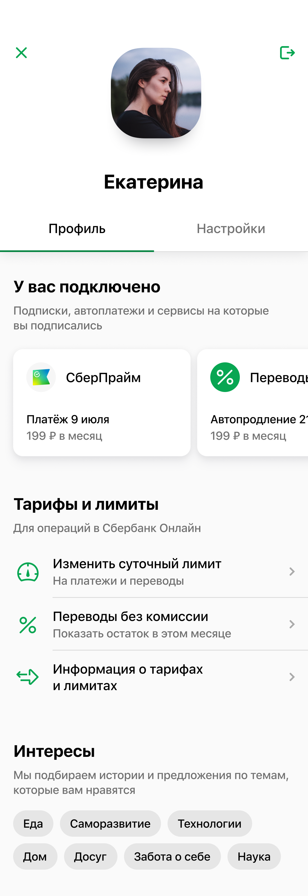
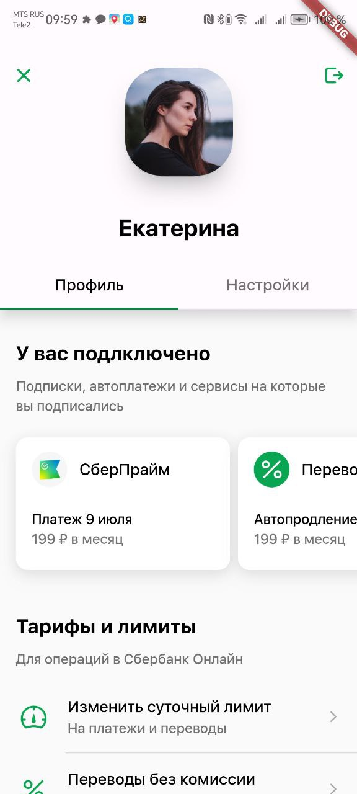
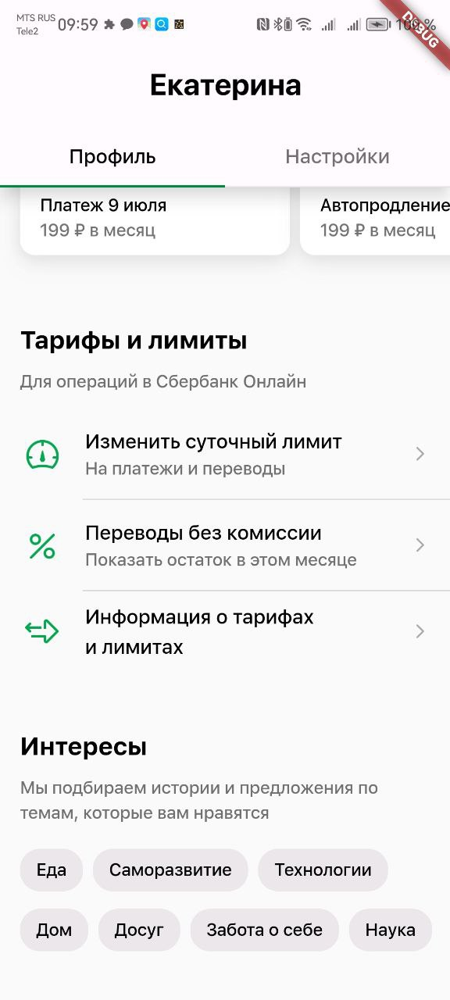
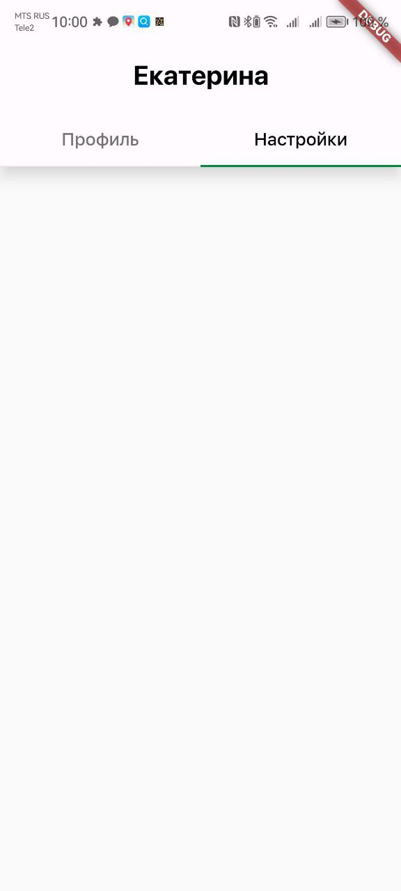

# Описание проекта


<div class="container" style="margin-bottom: 25px">
  
  
  
</div>

Данная работа была выполнена в рамках прохождения курса «Профессиональная разработка мобильных приложений» от компании Effective с целью получения первичных навыков в работе с фреймворком для кроссплатформенной разработки мобильных приложений __Flutter__.

Средствами представленной технологии необходимо было реализовать следующий экран:

<div style="display: flex; justify-content: center;">
    
</div>

&NewLine;
В результате работы с помощью фреймворка __Flutter__ было получено приложение с двумя экранами (настройки представлены в виде пустого экрана и добавлены с целью демострации функцииональности AppBar-а):
&NewLine;

<div style="display: flex; justify-content: space-around; flex-wrap: wrap; gap: 10px">
      
</div>

<div style="display: flex; align-items: center; margin-bottom: 15px;">
    Также был сгенерирован APK файл: 
    <a href="EffectiveFlutterLab.apk" download>
        
    </a>
</div>

```Используемая версия Flutter - 3.16.3```
